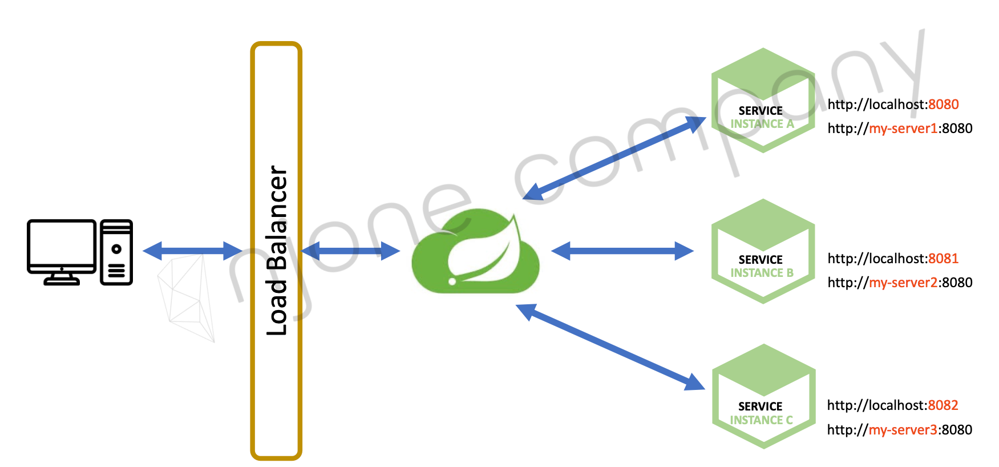
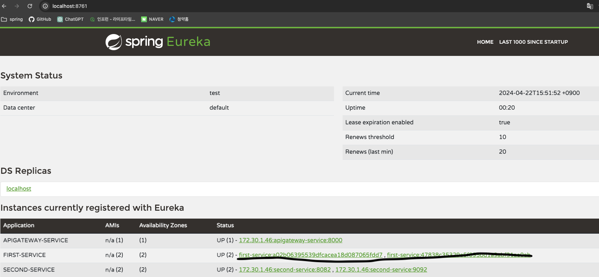

# Service Discovery

### Spring Cloud Netflix Eureka

***


- 현실 세계의 전화번호부와 비슷한 개념
- Eureka Server 는 Eureka Client 의 정보(포트, 도메인주소)를 갖는다.
- Spring Cloud Gateway 와 연동하여 Load Balancer 로서 부하분산 역할을 한다.

##### @EnableEurekaServer

***

```java

@SpringBootApplication
@EnableEurekaServer
public class DiscoveryserviceApplication {

  public static void main(String[] args) {
    SpringApplication.run(DiscoveryserviceApplication.class, args);
  }

}

```

##### @EnableDiscoveryClient

***

```java

@SpringBootApplication
@EnableDiscoveryClient
public class UserServiceApplication {

  public static void main(String[] args) {
    SpringApplication.run(UserServiceApplication.class, args);
  }

}

```

##### application.yml

***

```yaml
# Random Port
server:
  port: 0

eureka:
  instance:
    instance-id: ${spring.cloud.client.hostname}:${spring.application.instance_id:${random.value}}  # Eureka Server에 등록된 Instance 구분을 위해 instance-id 재정의
  client:
    register-with-eureka: true
    fetch-registry: true
    service-url:
      defaultZone: http://127.0.0.1:8761/eureka     # Eureka Server URL
```

### Eureka Server Index

***


