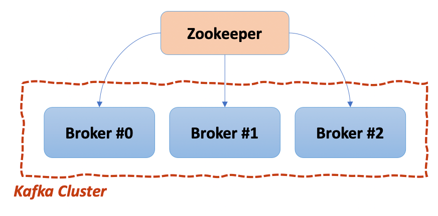
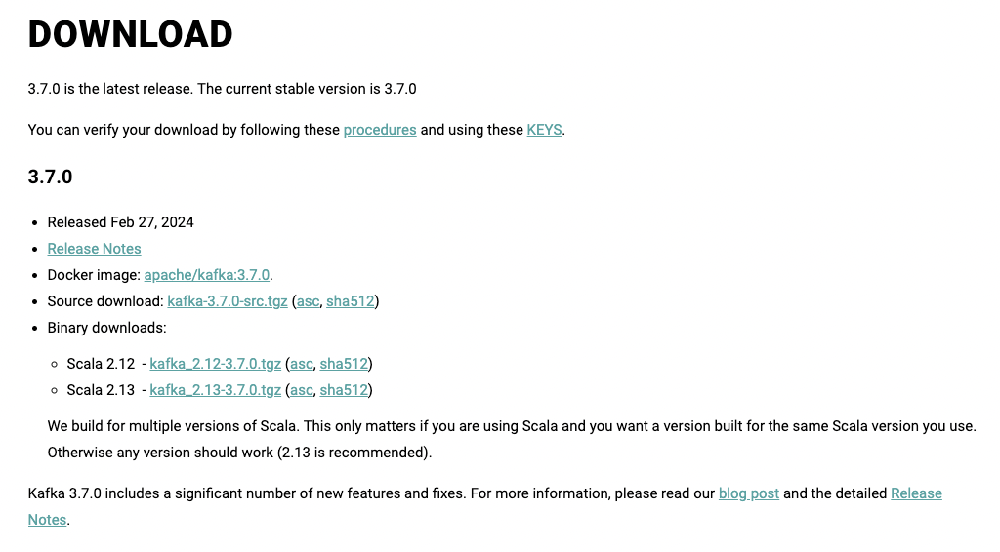
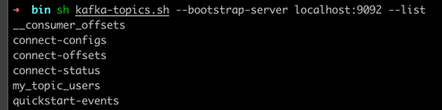
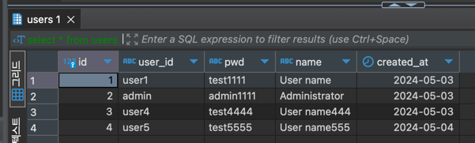

# Apache Kafka 활용

## Apache Kafka

- Apache Software Foundation의 Scalar 언어로 된 오픈소스 메시지 브로커
- Linked-In 에서 개발, 2011년에 오픈소스화
- Kafka 개발 엔지니어들이 Confluent 라는 회사 창립
- 실시간 데이터 피드를 관리하기 위해 통일된 높은 처리량, 낮은 지연 시간을 지닌 플랫폼 제공

### Before Applying Kafka


- End-to-End 연결 방식 아키텍처
- 데이터 연동의 복잡성 증가 (HW, OS, 통신 장애 등)
- 서로 다른 데이터 Pipeline 연결
- 확장이 어려운 구조

***
### After Applying Kafka


- Producer / Consumer 분리
- 메시지를 여러 Consumer 에게 허용
- 높은 처리량을 위한 메시지 최적화
- Scale-Out 가능
- Eco-System

***
### Kafka Broker
- 실행 된 Kafka 애플리케이션 서버
- 3대 이상의 Broker Cluster 구성
- Zookeeper 연동
  - 역할 : 메타데이터(Broker ID, Controller ID 등) 저장
  - Controller 정보 저장
- n개 Broker 중 1대는 Controller 기능 수행
  - Controller 역할
    - 각 Broker에게 담당 파티션 할당 수행
    - Broker 정상 동작 모니터링 관리



***
### Kafka 설치

https://kafka.apache.org/downloads



- download : kafka_2.13-3.7.0.tgz

***
### Kafka Client

- Kafka와 데이터를 주고 받기 위해 사용하는 Java Library
- Producer, Consumer, Admin, Stream 등 Kafka 관련 API 제공
- 다양한 3rd party library 존재 : C/C++, Node.js, Python, .NET 등


***
### Kafka 서버 기동

1. Zookeeper 서버 기동

```shell
sh $KAFKA_HOME/bin/zookeeper-server-start.sh $KAFKA_HOME/config/zookeeper.properties
```

2. Kafka 서버 기동

```shell
sh $KAFKA_HOME/bin/kafka-server-start.sh $KAFKA_HOME/config/kafka-server.properties
```

3. Topic 생성

- name : quickstart-events

```shell
sh $KAFKA_HOME/bin/kafka-topics.sh --bootstrap-server localhost:9092 --create --topic quickstart-events --partitions 1
```

4. Topic 목록 확인
- quickstart-events

```shell
sh $KAFKA_HOME/bin/kafka-topics.sh --bootstrap-server localhost:9092 --list
```



5. Topic 상세 목록 확인

```shell
sh $KAFKA_HOME/bin/kafka-topics.sh --bootstrap-server localhost:9092 --describe --topic quickstart-events
```

6. quickstart-events Topic 메세지 공급

```shell
sh $KAFKA_HOME/bin/kafka-console-producer.sh --broker-list localhost:9092 --topic quickstart-events
```

7. quickstart-events Topic 메세지 수급

```shell
sh $KAFKA_HOME/bin/kafka-console-consumer.sh --bootstrap-server localhost:9092 --topic quickstart-events --from-beginning
```


***
### Kafka Connect
- Kafka Connect를 통해 Data Import / Export
- 코드 없이 Configuration으로 데이터 이동
- Standalone mode, Distribution mode 지원
  - RESTful API 지원
  - Stream 또는 Batch 형태로 데이터 전송 가능
  - 커스텀 Connector 를 통한 다양한 Plugin 제공 (File, Hive, MySql, etc...)


***
### Confluent Kafka Connect 설치

1. Confluent Kafka Connect 설치
  https://docs.confluent.io/platform/current/installation/installing_cp/zip-tar.html

```shell
curl -O https://packages.confluent.io/archive/7.6/confluent-7.6.1.tar.gz
```

2. CONFLUENT_HOME 환경변수 등록

```shell
export CONFLUENT_HOME=~/Desktop/kafka/confluent-7.6.1
export PATH=$PATH:$CONFLUENT_HOME/bin
```

3. Kafka Connect 실행

```shell
$CONFLUENT_HOME/bin/connect-distributed $CONFLUENT_HOME/etc/kafka/connect-distributed.properties
```

4. Topic 목록 확인
- __consumer_offsets
- connect-configs
- connect-offsets
- connect-status

```shell
sh $KAFKA_HOME/bin/kafka-topics.sh --bootstrap-server localhost:9092 --list
```


***
### Confluent Kafka JDBC Connector 설치

https://www.confluent.io/hub/confluentinc/kafka-connect-jdbc


1. Self-Hosted Download
   - confluentinc-kafka-connect-jdbc-10.7.6.zip


2. $CONFLUENT_HOME/etc/kafka/connect-distributed.properties 파일에 plugin.path 정보 추가

   - plugin.path= {confluentinc-kafka-connect-jdbc-10.7.6/lib}

```shell
vi $CONFLUENT_HOME/etc/kafka/connect-distributed.properties

# plugin.path 입력
plugin.path=/Users/kj/Desktop/kafka/confluentinc-kafka-connect-jdbc-10.7.6/lib
```

3. confluentinc-kafka-connect-jdbc-10.7.6 경로에 postgresql 드라이버 복사

```shell
cp postgresql-42.6.2.jar /Users/kj/Desktop/kafka/confluent-7.6.1/share/java/kafka
```

***
### Kafka Source Connect 추가

**- Connector 등록**
- POST http://localhost:8083/connectors
- Body
```json
{
  "name" : "my-source-connect",
  "config" : {
  "connector.class" : "io.confluent.connect.jdbc.JdbcSourceConnector",
  "connection.url":"jdbc:postgresql://localhost:54315/{db.name}",
  "connection.user":"{db.user}",
  "connection.password":"{db.password}",
  "mode": "incrementing",
  "incrementing.column.name" : "id",
  "table.whitelist":"users",    // 타겟 Table
  "topic.prefix" : "my_topic_", // {topic.prefix}+{table.whitelist} 명으로 topic 생성 됨
  "tasks.max" : "1"
  }
}
```


**- Connector 확인**

- GET http://localhost:8083/connectors
  - my-source-connect


***
### Kafka Source Connect 테스트

1. postgresql 에서 users 테이블에 row 데이터 추가

```postgresql
insert into users(user_id, pwd, name) values('user5', 'test5555', 'User name555');
```

2. Kafka Consumer 수신 확인

```shell
sh kafka-console-consumer.sh --bootstrap-server localhost:9092 --topic my_topic_users

# Kafka Jdbc 텍스트 템플릿으로 수신 확인 
{"schema":{"type":"struct","fields":[{"type":"int64","optional":false,"field":"id"},{"type":"string","optional":true,"field":"user_id"},{"type":"string","optional":true,"field":"pwd"},{"type":"string","optional":true,"field":"name"},{"type":"int32","optional":true,"name":"org.apache.kafka.connect.data.Date","version":1,"field":"created_at"}],"optional":false,"name":"users"},"payload":{"id":5,"user_id":"user5","pwd":"test5555","name":"User name555","created_at":19847}}
```


***
### Kafka Sink Connect 설치

**- Connector 등록**
- POST http://localhost:8083/connectors
- Body
```json
{
  "name" : "my-sink-connect",
  "config" : {
    "connector.class" : "io.confluent.connect.jdbc.JdbcSinkConnector",
    "connection.url":"jdbc:postgresql://localhost:54315/{db.name}",
    "connection.user":"{db.user}",
    "connection.password":"{db.password}",
    "auto.create": "true",  // my_topic_users(topic name) 테이블 자동 생성
    "auto.evolve" : "true",
    "delete.enabled":"false",
    "tasks.max" : "1",
    "topics" : "my_topic_users" // == (source topic name)
  }
}
```


**- Connector 확인**

- GET http://localhost:8083/connectors
  - my-sync-connect


***
### Kafka Sink Connect 테스트

1. postgresql 에서 users 테이블에 row 데이터 추가

```postgresql
insert into users(user_id, pwd, name) values('user5', 'test5555', 'User name555');
```

2. Kafka Consumer 수신 확인

```shell
sh kafka-console-consumer.sh --bootstrap-server localhost:9092 --topic my_topic_users

# Kafka Jdbc 텍스트 템플릿으로 수신 확인 
{"schema":{"type":"struct","fields":[{"type":"int64","optional":false,"field":"id"},{"type":"string","optional":true,"field":"user_id"},{"type":"string","optional":true,"field":"pwd"},{"type":"string","optional":true,"field":"name"},{"type":"int32","optional":true,"name":"org.apache.kafka.connect.data.Date","version":1,"field":"created_at"}],"optional":false,"name":"users"},"payload":{"id":5,"user_id":"user5","pwd":"test5555","name":"User name555","created_at":19847}}
```

3. postgresql 에서 users / my_topic_users 테이블 조회

- users 데이터를 insert 하면 my_topic_users 에 아래 이미지 경로를 통해 자동 insert 처리

  

```postgresql
select * from users;
select * from my_topic_users;
```




***
### Kafka Sink Connect 테스트(Kafka Producer)

- Producer 콘솔 request 를 통해 Sink Connect 처리 되었기 때문에 users 테이블에는 데이터가 없고 my_topic_users 테이블에만 데이터 존재

.png)

