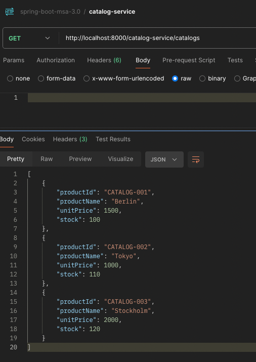
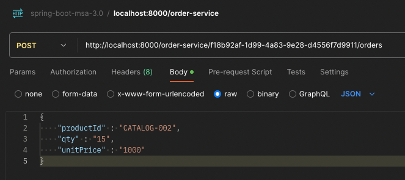
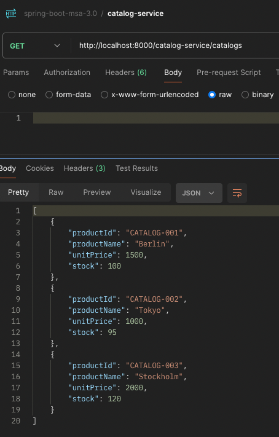
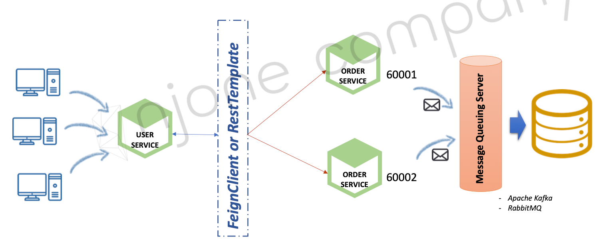
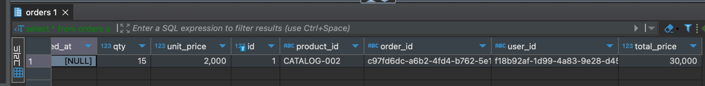

# Apache Kafka 활용-2

## 데이터 동기화 order-service -> catalog-service

- order-service 에 요청된 주문 수량 정보를 catalog-service 에 반영
- order-service 에서 Kafka Topic 으로 메세지 전송

  **-> Producer**

- catalog-service 에서 Kafka Topic에 전송된 메세지 수신

  **-> Consumer**


## catalog-service

#### KafkaConsumer 구현
```java
@KafkaListener(topics = "example-catalog-topic")  // example-catalog-topic 토픽 리스닝
```

```java
@Slf4j
@RequiredArgsConstructor
@Service
public class KafkaConsumer {

  private final CatalogRepository repository;
  private final ObjectMapper objectMapper;

  @KafkaListener(topics = "example-catalog-topic")
  @Transactional
  public void updateQty(String kafkaMessage) throws JsonProcessingException {
    log.info("Kafka Message : " + kafkaMessage);

    Map<String, Object> map = objectMapper.readValue(kafkaMessage, Map.class);

    Catalog catalog = repository.findByProductId((String) map.get("productId"))
        .orElseThrow();

    catalog.decreaseStock((Integer) map.get("qty"));
  }
}

```

***
## order-service

#### KafkaProducer 구현

example-catalog-topic 토픽으로 메세지 전송

```java
@Slf4j
@RequiredArgsConstructor
@Service
public class KafkaProducer {

  private final ObjectMapper objectMapper;
  private final KafkaTemplate<String, String> kafkaTemplate;

  public OrderDto send(String topic, OrderDto orderDto) throws JsonProcessingException {
    String jsonString = objectMapper.writeValueAsString(orderDto);
    kafkaTemplate.send(topic, jsonString);
    log.info("Kafka Producer sent data from the Order microservice : " + jsonString);

    return orderDto;
  }
}

```

```java
  @PostMapping("/{userId}/orders")
  public ResponseEntity<OrderResponse> createOrder(@PathVariable String userId,
      @RequestBody OrderRequest request) throws JsonProcessingException {

    OrderDto dto = mapper.toDto(request);
    dto.setUserId(userId);
    dto.setTotalPrice(dto.getQty() * dto.getUnitPrice());
    dto.setCreatedAt(LocalDate.now());
    dto.setOrderId(UUID.randomUUID().toString());
//    dto = service.createOrder(dto);

    //send kafka
    kafkaProducer.send("example-catalog-topic", dto);
    orderProducer.send("orders", dto);

    return ResponseEntity.status(HttpStatus.CREATED)
        .body(mapper.toResponse(dto));
  }
```
***
## Postman 테스트

#### (1) CATALOG-002 상품 주문 전 재고 110개


#### (2) CATALOG-002 상품 15개 주문


#### (3) CATALOG-002 상품 주문 후 재고 95개


***
## Multiple Order Service

#### Kafka Sink Connect 를 사용해 단일 DB에 저장
- DB 다이렉트 전송이 아닌 Kafka Topic에 메세지를 전송 
  

#### OrderProducer 구현 

```java
@Slf4j
@RequiredArgsConstructor
@Service
public class OrderProducer {

  private final ObjectMapper objectMapper;
  private final KafkaTemplate<String, String> kafkaTemplate;
  private List<Field> fields = Arrays.asList(new Field("string", true, "order_id"),
      new Field("string", true, "user_id"),
      new Field("string", true, "product_id"),
      new Field("int32", true, "qty"),
      new Field("int32", true, "unit_price"),
      new Field("int32", true, "total_price")
  );

  private Schema schema = Schema.builder()
      .type("struct")
      .fields(fields)
      .optional(false)
      .name("orders")
      .build();

  public OrderDto send(String topic, OrderDto orderDto) throws JsonProcessingException {
    Payload payload = Payload.builder()
        .orderId(orderDto.getOrderId())
        .userId(orderDto.getUserId())
        .productId(orderDto.getProductId())
        .qty(orderDto.getQty())
        .unitPrice(orderDto.getUnitPrice())
        .totalPrice(orderDto.getTotalPrice())
        .build();

    KafkaOrderDto kafkaOrderDto = new KafkaOrderDto(schema, payload);

    String jsonString = objectMapper.writeValueAsString(kafkaOrderDto);
    kafkaTemplate.send(topic, jsonString);
    log.info("Kafka Producer sent data from the Order microservice : " + jsonString);

    return orderDto;
  }
}

```
#### 주문 요청 시 "orders" Kafka Topic 에 메세지 전송

```java
  @PostMapping("/{userId}/orders")
  public ResponseEntity<OrderResponse> createOrder(@PathVariable String userId, @RequestBody OrderRequest request) throws JsonProcessingException {

    OrderDto dto = mapper.toDto(request);
    dto.setUserId(userId);
    dto.setTotalPrice(dto.getQty() * dto.getUnitPrice());
    dto.setCreatedAt(LocalDate.now());
    dto.setOrderId(UUID.randomUUID().toString());
//    dto = service.createOrder(dto);

    //send kafka
    kafkaProducer.send("example-catalog-topic", dto);
    orderProducer.send("orders", dto);

    return ResponseEntity.status(HttpStatus.CREATED)
        .body(mapper.toResponse(dto));
  }
```

## Postman 테스트

#### (1) CATALOG-002 상품 15개 주문


#### (2) kafka-console-consumer 로 orders 토픽 메세지 수신 확인
```shell
$ sh $KAFKA_HOME/bin/kafka-console-consumer.sh --bootstrap-server localhost:9092 --topic orders --from-beginning
```

**Kafka JdbcSinkConnector 형식의 JSON 메세지 수신 됨**
```json
{
  "schema": {
    "type": "struct",
    "fields": [
      {
        "type": "string",
        "optional": true,
        "field": "order_id"
      },
      {
        "type": "string",
        "optional": true,
        "field": "user_id"
      },
      {
        "type": "string",
        "optional": true,
        "field": "product_id"
      },
      {
        "type": "int32",
        "optional": true,
        "field": "qty"
      },
      {
        "type": "int32",
        "optional": true,
        "field": "unit_price"
      },
      {
        "type": "int32",
        "optional": true,
        "field": "total_price"
      }
    ],
    "optional": false,
    "name": "orders"
  },
  "payload": {
    "qty": 15,
    "order_id": "1fc7d6ca-c8f5-429e-8940-c91f0c1fd1e0",
    "user_id": "f18b92af-1d99-4a83-9e28-d4556f7d9911",
    "product_id": "CATALOG-002",
    "unit_price": 1000,
    "total_price": 15000
  }
}
```

#### (3) 데이터 정상 확인

```sql
select * from orders;
```




