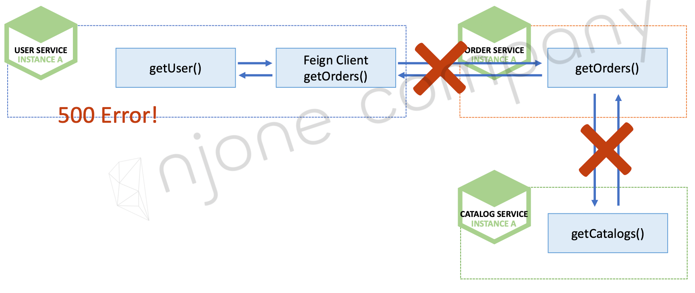
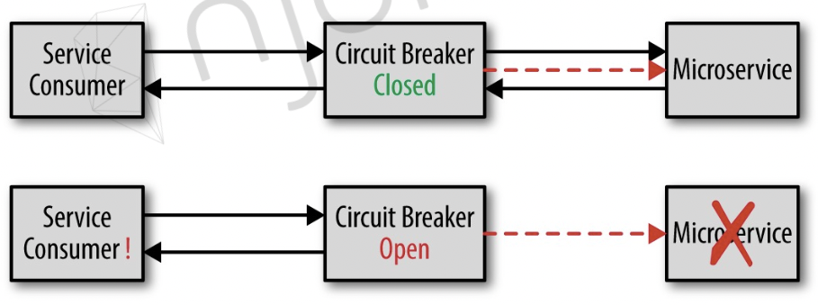
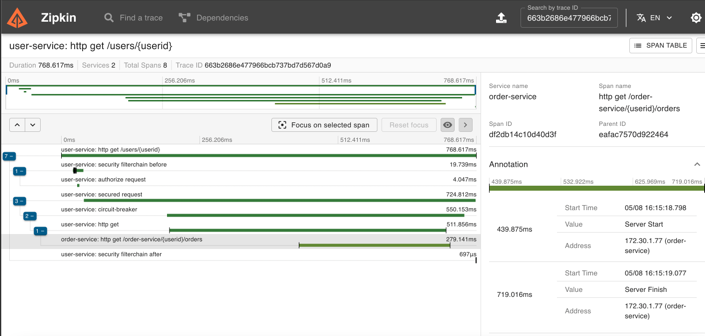

# 장애처리와 Microservice 분산 추적

## Microservice 통신 연쇄 오류



## Microservice 통신 연쇄 오류 발생 시 호출하지 않고 정상 응답 


## CircuitBreaker
- 장애가 발생하는 서비스에 반복적인 호출이 되지 못하게 차단
- 특정 서비스가 정상적으로 동작하지 않을 경우 다른 기능으로 대체 수행
- 장애 회피
- default(서버 상태 정상)는 close 상태



***
### CircuitBreaker-Resilience4j
**- UserController**

오류발생 시 Empty ArrayList 반환

```java
    CircuitBreaker circuitbreaker = circuitBreakerFactory.create("circuitbreaker");
    List<OrderResponse> orderResponses = circuitbreaker.run(() -> orderServiceClient.getOrders(userId),
        throwable -> new ArrayList<>());
```
***
#### Customize Resilience4JCircuitBreakerFactory
**- Resilience4JConfig**

- failureRateThreshold : 실패 임계치 % 설정
- waitDurationInOpenState : 써킷 open 지속 시간, 설정 시간이 지나면 half-open 상태로 변경
  - half-open 상태에서는 permittedNumberOfCallsInHalfOpenState 설정 값 만큼 수행 후 성공 시 closed, 실패 시 open 상태로 변경한다.
- slidingWindowType
  - COUNT_BASED : 마지막 slidingWindowSize call 을 기준으로 실패 임계치 계산
  - TIME_BASED : 마지막 slidingWindowSize 초 동안의 call 을 기준으로 실패 임계치 계산
- minimumNumberOfCalls : 실패 임계치 계산을 수행하기 위한 최소 Call 조건
  - 10으로 설정되어 있는데 9번 오류 발생해도 써킷은 open 되지 않는다.
- TimeLimiterConfig.timeoutDuration : supplier 서비스(order-service)의 타임아웃 오류 발생 기준 seconds

```java
@Configuration
public class Resilience4JConfig {

  @Bean
  public Customizer<Resilience4JCircuitBreakerFactory> globalCustomConfiguration() {
    CircuitBreakerConfig circuitBreakerConfig = CircuitBreakerConfig.custom()
        .failureRateThreshold(4)  //실패 임계치 % 설정
        .waitDurationInOpenState(Duration.ofSeconds(4)) //써킷 open 지속 시간
        .slidingWindowType(CircuitBreakerConfig.SlidingWindowType.COUNT_BASED)  //카운트 or 시간 기반으로 설정할 수 있음
        .slidingWindowSize(2)   // 카운트일 경우 사이즈 만큼의 마지막 요청 횟수로 실패 임계치 계산, 시간일 경우 사이즈 만큼의 seconds 로 call 집계해서 실패 임계치 계산  
        .build();

    TimeLimiterConfig timeLimiterConfig = TimeLimiterConfig.custom()
        .timeoutDuration(Duration.ofSeconds(4)) //supplier 서비스(order-service)의 타임아웃 오류 발생 기준 seconds
        .build();

    return factory -> factory.configureDefault(id -> new Resilience4JConfigBuilder(id)
        .timeLimiterConfig(timeLimiterConfig)
        .circuitBreakerConfig(circuitBreakerConfig)
        .build()
    );
  }
}

```
***
## MicroService 분산 추적

### Spring Cloud Sleuth + Zipkin

- Trace
  - 트리 구조로 이루어진 span 셋
  - 하나의 요청에 대한 같은 traceId 발급
- Span
  - 하나의 요청에 사용되는 작업 단위


#### Spring Cloud Sleuth

- Zipkin과 연동
- 요청 값에 따른 traceId, spanId 부여

#### Zipkin

- Spring Cloud Sleuth 로 부터 전달받은 traceId, spanId 를 받아 통계 처리 담당

***
#### Zipken 설정

**- user-service>pom.xml**

- Spring Boot 3.2 버전 기준으로 dependency 설정
- io.github.openfeign:feign-micrometer
  - feignClient 요청 간 traceId 를 동일하게 맞추기 위해서는 feign-micrometer 의존성 추가 필수

```xml
    <dependency>
      <groupId>io.micrometer</groupId>
      <artifactId>micrometer-observation</artifactId>
    </dependency>

    <dependency>
      <groupId>io.micrometer</groupId>
      <artifactId>micrometer-tracing-bridge-brave</artifactId>
    </dependency>

    <dependency>
      <groupId>io.zipkin.reporter2</groupId>
      <artifactId>zipkin-reporter-brave</artifactId>
    </dependency>

    <dependency>
      <groupId>io.github.openfeign</groupId>
      <artifactId>feign-micrometer</artifactId>
    </dependency>
```

**- order-service>pom.xml**
- Spring Boot 3.2 버전 기준으로 dependency 설정
- spring-boot-starter-actuator 필수
  - actuator-autoconfiguration 라이브러리가 반드시 필수
  - user-service에는 이미 추가 되어 있었음
```xml
    <dependency>
      <groupId>org.springframework.boot</groupId>
      <artifactId>spring-boot-starter-actuator</artifactId>
    </dependency>

    <dependency>
      <groupId>io.micrometer</groupId>
      <artifactId>micrometer-observation</artifactId>
    </dependency>

    <dependency>
      <groupId>io.micrometer</groupId>
      <artifactId>micrometer-tracing-bridge-brave</artifactId>
    </dependency>

    <dependency>
      <groupId>io.zipkin.reporter2</groupId>
      <artifactId>zipkin-reporter-brave</artifactId>
    </dependency>
```

***
### Zipkin 확인

**- 채번된 traceId 입력 : 663b2686e477966bcb737bd7d567d0a9**



서비스 간 요청 순서 대로 Trace 확인 가능
