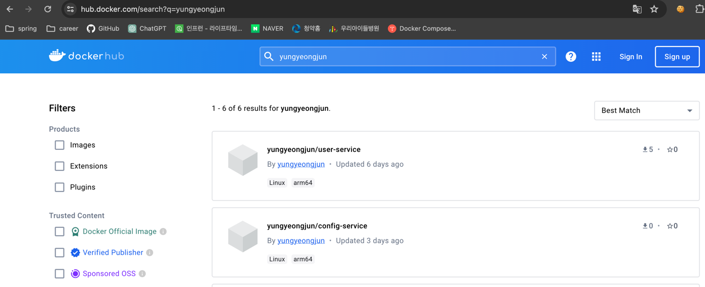

# 어플리케이션 배포를 위한 컨테이너 가상화

- **OS Virtualization**
  - Host OS 위에 Guest OS 전체를 가상화
  - VMWare, VirtualBox
  - 자유도가 높으나, 시스템에 부하가 많고 느려짐


- **Container Virtualization**
  - Host OS가 가진 리소스를 적게 사용하며 필요한 프로세스 실행
  - 최소한의 라이브러리와 도구만 포함
  - Container 생성 속도 빠름


***
### Container Image
- Container 실행에 필요한 설정 값
  - 상태 값 X, Immutable(불변)
- Image를 가지고 실체화 -> Container


### Dockerfile
- Docker Image 를 생성하기 위한 스크립트 파일
- 자체 DSL(Domain-Specific Language) 언어 사용

```dockerfile
FROM openjdk:17-ea-slim
VOLUME /tmp
COPY target/user-service-0.0.1-SNAPSHOT.jar user-service.jar
ENTRYPOINT ["java", "-jar", "user-service.jar"]
```

***
### Docker 실행

```shell
docker run [OPTIONS] IMAGE[:TAG|@DIGEST] [COMMAND] [ARG...]
```

|옵션|설명|
|-d|detached mode, 백그라운드 모드|
|-p|호스트와 컨테이너 포트 연결(포워딩)|
|-v|호스트와 컨테이너의 디렉터리 연결(마운트)|
|-e|컨테이너 내부에서 사용할 환경변수 설정|
|-name| 컨테이너 이름 설정|
|-rm| 컨테이너 종료 시 컨테이너 자동 제거|
|-it| 터미널 입력을 위한 옵션|
|-link| 컨테이너 연결|

### Dockerfile for user-service

1. Dockerfile 생성
```dockerfile
FROM openjdk:17-ea-slim
VOLUME /tmp
COPY target/user-service-0.0.1-SNAPSHOT.jar user-service.jar
ENTRYPOINT ["java", "-jar", "user-service.jar"]
```

2. docker build 수행

```shell
docker build -t yungyeongjun/user-service:0.0.1
```

3. docker push 수행(docker hub 등록)

```shell
docker push yungyeongjun/user-service:0.0.1
```


