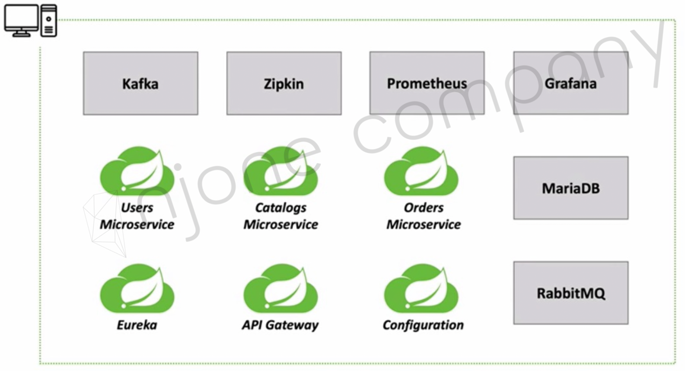
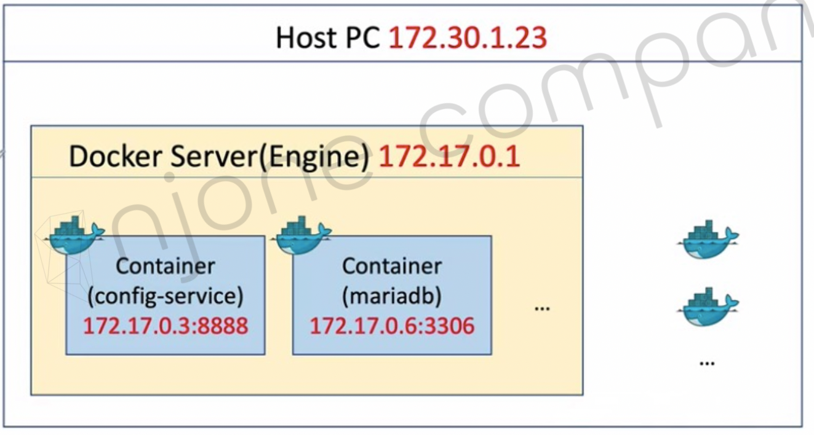
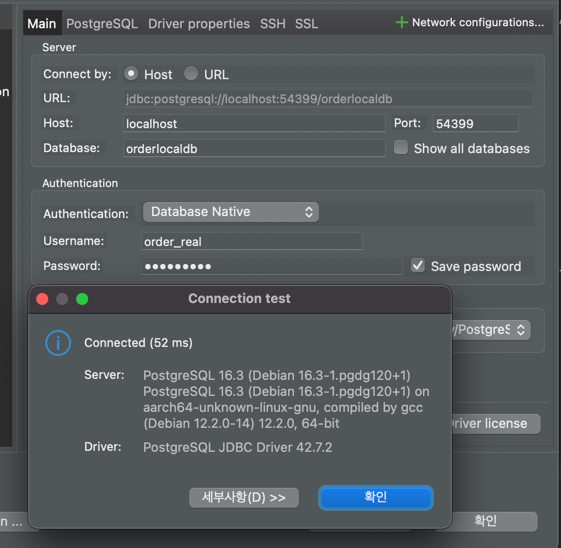
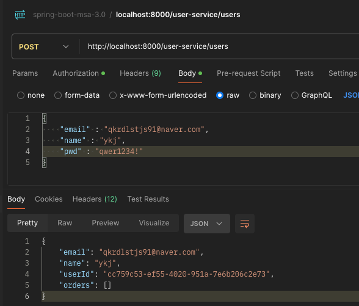
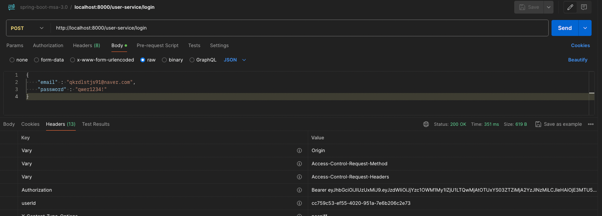
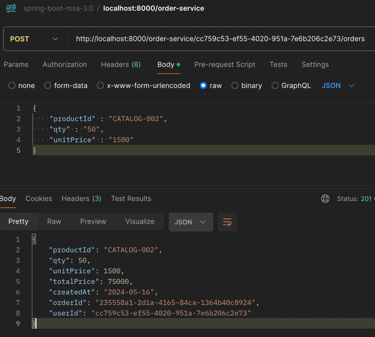

# 어플리케이션 배포 - Docker Container

### Running Microservices in Local

- MicroService
  - user-service
  - order-service
  - catalog-service


- Config Server
  - config-service (Spring Cloud Config Server)


- Gateway Server
  - apigateway-service (Spring Cloud Gateway)


- Discovery Server
  - discovery-service (Spring Cloud Netflix-Eureka-Server)


- DB
  - postgres (postgres로 구현해보았음)


- Log Tracing
  - Zipkin


- Message Queue
  - RabbitMQ (Spring Cloud Bus)
    - Config Server - MicroService 간 일괄 메세지 전송 서버
  - Kafka
    - MicroService 간 통신 메세지 큐잉 서버


- Monitoring
  - prometheus
  - grafana



***
### Create Network

- Bridge Network

  \- Host / Container 간 네트워크 bridge 역할


- Host Network
  
  &dash; Bridge 네트워크 없이 Host 네트워크 그대로 사용


- None Network

  &dash; 네트워크를 사용하지 않음

***
### Bridge 네트워크 생성

```shell
docker network create --gateway 172.18.0.1 --subnet 172.18.0.0/16 ecommerce-network
```

```shell
docker network ls # 네트워크 확인
```

***
### 동일한 IP 대역대를 갖는 컨테이너 구조



***
### 1. Run RabbitMQ

```shell
docker run -d --name rabbitmq --network ecommerce-network \
            -p 15672:15672 -p 5672:5672 -p 15671:15671 -p 4369:4369 \
            -e RABBITMQ_DEFAULT_USER=guest -e RABBITMQ_DEFAULT_PASS=guest rabbitmq:management
```

***
### 2. Run Config-Server

***
#### 2-1. Create Docker Image

```dockerfile
FROM openjdk:17-ea-slim
VOLUME /tmp
COPY apiEncryptionKey.jks apiEncryptionKey.jks    # api 암호화 Key 컨테이너 내부 루트경로에 복사
COPY target/config-service-0.0.1-SNAPSHOT.jar config-service.jar
ENTRYPOINT ["java", "-jar", "config-service.jar"]
```

***
#### 2-2. jks 파일 경로 변경
  - Local >> Container 경로로 변경
  
  ```yaml
  encrypt:
    key-store:
      #    location: file://${user.home}/IdeaProjects/inflearn-spring-boot-msa/springboot-msa-3.0/config-service/apiEncryptionKey.jks
      location: file:/apiEncryptionKey.jks
      password: 1q2w3e4r
      alias: apiEncryptionKey
  ```
***
#### 2-3. Docker Build & Run

- Dockerfile 경로에서 docker build 수행

  ```shell
  docker build --tag yungyeongjun/config-service:0.0.1 .
  ```

- docker image 확인

  ```shell
  build docker images
  ```

- docker run

  ```shell
  docker run -d -p 8888:8888 --network ecommerce-network \
          -e "spring.rabbitmq.host=rabbitmq" -e "spring.profiles.active=default" \
          --name config-service yungyeongjun/config-service:0.0.1
  ```

- docker 컨테이너 정상 확인

  ```shell
  docker ps -a
  ```

- docker 기동 로그 확인

  ```shell
  docker logs -f config-service  # -f 옵션 : 리눅스 tail 과 같음
  ```

- 이상 없으면 Docker Image Push

  ```shell
  docker push yungyeongjun/config-service:0.0.1
  ```

***
### 3. Run Discovery Server

```shell
docker run -d -p 8761:8761 --network ecommerce-network \
        -e "spring.cloud.config.uri=http://config-serice:8888" \
        --name discovery-service yungyeongjun/discovery-service:0.0.1
```

> Config Server 와 같은 방식으로 진행
> (생략...)

***
### 4. Run ApiGateway Server

```shell
docker run -d -p 8000:8000 --network ecommerce-network \
	-e "spring.cloud.config.uri=http://config-service:8888" \
	-e "spring.rabbitmq.host=rabbitmq" \
	-e "eureka.client.service-url.defaultZone=http://discovery-service:8761/eureka" \
	--name apigateway-service yungyeongjun/apigateway-service:0.0.1
```

***
### 5. Run Postgresql Server (order-db, user-db, catalog-db)

- docker run 이 아닌 docker-compose 로 기동
- 각 마이크로서비스 별로 DB 서버 기동

***
##### 5-1. docker-compose.yml 파일 작성

```yaml
version: "3"

networks:
  ecommerce-network:
    external: true

services:
  postgres:
    image: postgres:16.3          # docker-hub의 postgres:16.3 버전 이미지 빌드
    restart: always
    container_name: order-db
    ports:
      - 54399:54316               # Host 포트 : 54399 / Docker Container 포트 : 54316 
    networks:
      - ecommerce-network         # ecommerce-network 로 기동
    environment:
      PGPORT: 54316               # Postgres 포트, Docker Container 포트와 일치 시켜줘야 함
      POSTGRES_USER: order_real   # postgres 슈퍼 계정 >> order_real 계정으로 대체
      POSTGRES_PASSWORD: qwer1234!
      POSTGRES_DB: orderlocaldb
    volumes:
      - "./init:/docker-entrypoint-initdb.d/"     # 초기화 쿼리 수행
```

***
#### 5-2. docker-compose build 수행

```shell
docker-compose up -d
```

***
#### 5-3. docker image 확인

```shell
docker images
```

***
#### 5-4. docker 컨테이너, 로그 확인

```shell
docker ps -a
docker logs -f order-db
```

***
#### 5-5. Host 접속 확인(Dbeaver 툴)



> user-db, catalog-db도 동일한 방식으로 컨테이너 기동

***
### 6. Run Kafka & Zookeeper (싱글브로커)

***
#### 6-1. docker-compose.yml 파일 작성

```yaml
version: '2'
networks:
  ecommerce-network:
    external: true

services:
  zookeeper:
    image: confluentinc/cp-zookeeper    # confluentinc/cp-zookeeper 이미지 빌드
    environment:
      ZOOKEEPER_SERVER_ID: 1            # zookeeper 식별 ID
      ZOOKEEPER_CLIENT_PORT: 2181       # zookeeper 포트
      ZOOKEEPER_TICK_TIME: 2000         # zookeeper 클러스터 동기화 타임 (2초)
      ZOOKEEPER_INIT_LIMIT: 5           # zookeeper 초기화 타임아웃 시간 (TICK_TIME * 5 = 10초), 멀티 브로커 일 때 유효
      ZOOKEEPER_SYNC_LIMIT: 2           # zookeeper 리더와 나머지 서버들의 싱크 타임 (TICK_TIME * 2 = 4초), 멀티 브로커 일 때 유효
    ports:
      - "22181:2181"
    networks:
      - ecommerce-network
  kafka:
    image: confluentinc/cp-kafka        # confluentinc/cp-kafka 이미지 빌드
    hostname: kafka
    ports:
      - "29092:29092"
    networks:
      - ecommerce-network
    environment:
      KAFKA_BROKER_ID: 1                              # kafka broker 식별 ID
      KAFKA_ZOOKEEPER_CONNECT: 'zookeeper:2181'       # zookeeper 커넥션 대상
      KAFKA_ADVERTISED_LISTENERS: PLAINTEXT://kafka:9092,PLAINTEXT_HOST://localhost:29092   # 외부에서 접속하기 위한 리스너 설정 
      KAFKA_LISTENER_SECURITY_PROTOCOL_MAP: PLAINTEXT:PLAINTEXT,PLAINTEXT_HOST:PLAINTEXT    # 보안을 위한 프로토콜 매핑, KAFKA_ADVERTISED_LISTENERS 와 함께 key/value로 매핑 
      KAFKA_INTER_BROKER_LISTENER_NAME: PLAINTEXT       # 도커 내부에서 사용할 리스너 이름
      KAFKA_OFFSETS_TOPIC_REPLICATION_FACTOR: 1         # 트랜잭션 상태에서 복제 계수 지정
      KAFKA_GROUP_INITIAL_REBALANCE_DELAY_MS: 0         # 카프카 그룹이 초기 리밸런싱할때 컨슈머들이 컨슈머 그룹에 조인할때 대기 시간
    depends_on:
      - zookeeper           # zookeeper 기동 후 기동
```

> 이하 생략...

***
#### 6-2. 카프카 UI 툴로 Host 환경에서 정상 접속 확인 (Offset Explorer)


***
### 7. Run Zipkin & Prometheus & grafana
***
#### 7-1. Run Zipkin

```shell
docker run -d -p 9411:9411 --network ecommerce-network --name zipkin openzipkin/zipkin
```
***
#### 7-2. prometheus.yml 파일 작성

- localhost >> docker container 명으로 변경

  ```yaml
  global:
    scrape_interval: 15s
  
  scrape_configs:
    - job_name: "prometheus"
      static_configs:
      - targets: ["prometheus:9090"]
    - job_name : "user-service"
      scrape_interval: 15s
      metrics_path: "/user-service/actuator/prometheus"
      static_configs:
      - targets: ["apigateway-service:8000"]
    - job_name : "apigateway-service"
      scrape_interval: 15s
      metrics_path: "/actuator/prometheus"
      static_configs:
      - targets: ["apigateway-service:8000"]
    - job_name : "order-service"
      scrape_interval: 15s
      metrics_path: "/order-service/actuator/prometheus"
      static_configs:
      - targets: ["apigateway-service:8000"]
  
  ```
***
#### 7-3. Run Prometheus

```shell
docker run -d -p 9090:9090 --network ecommerce-network --name prometheus \
        -v ./prometheus.yml:/etc/prometheus/prometheus.yml \    # volume 옵션
        prom/prometheus
```

***
#### 7-4. Run Grafana

```shell
docker run -d -p 3000:3000 --network ecommerce-network --name grafana grafana/grafana
```

> 이하 생략

***
### 8. Run User-Service & Order-Service & Catalog-Service

***
#### 8-1. Run User-Service

***
##### 8-1-1. Config 서버에 설정된 Git Config 파일 변경

- user-service.yml

  ```yaml
  spring:
    datasource:
      #  url: jdbc:h2:tcp://localhost:9099/~/testdb  # localhost 버전
      #  url: jdbc:h2:tcp://h2db:1521/~./testdb      # docker-h2 버전
      #  driver-class-name: org.h2.Driver
      url: jdbc:postgresql://user-db:54316/userlocaldb  # docker-postgres 버전 > user-db 컨테이너명 설정
      username: user_real
      password: '{cipher}AQBxuV51450yCph7gxm51lE/Z0QdwpoTFrVUpdEIkqGRZaZ0mFmfqyn63/vjI8Q/3A2zbQVxsjmT0AnczyJUlTzEiegMgUooAzuXZu1vgCHLMEbTMPD0myMPj1J7cjMk2xOf5MNoZ0V8N88g9omx3E0Hlw0ofO2mjYsBvICC9+5/gTHBux9KYfJvcphF7LqwZql/IqZM4/JXNH4bVQV7GOLivzQTa5fyAgNJ5nAgnWPJ4vs1Nu0+JPQjmxNF0/FW9mOxjDSCfv2Nf2O+Mmah+Tkqy96J4kFFuFTnRrUMPWdU4LT9yznKYbyIb/fyvBy5qNN+ZoMsvKmf2s9Zg3gCw4M1MlbkhMqmQs+AzMjku9+rsoK9NRnM2GlsRoe45SoITcU='
      driver-class-name: org.postgresql.Driver
  
  token:
    expiration_time: 86400000
    secret: '{cipher}AQCcxKPovi3qWE4y7Apk8JvcIvf8wJNiPcJPkAMQJrzhJhZFecmIf7n1SgHb3wWVo4IOQtOXtDBRnoXDVEPd4AiHD+9ZC6CW3aXpGRAi0S/KUy8iENMm9CCatK0WZ07aU161dWekgyR2F3W8r1gLb98/TjvmbMnpX9Mi/onH/HViKEdGlGoQ28xbhNWIzqwLPjF+BIktRWdLVzmWdq/g2l2kHUR6/XrwSZsBbOHxAPBI45V7ROWGXuL43XbUOmZU3l/t6p1QHkl1SOFoDlhYEPUoXTvMVc441ManFZzghwctTQqpra66QPyTZxljyyBWdzjixeAxJLYXDSc6cjDZfWqi32D96SsbMoAfg19u7CLpvcKCui4T3EGtoFbQfY9clMBeDn7XlyFW2Hm5sgUi0DAsZeR+u0kJy3oHQmn+NqW67EvednkbJ/fSc2r9ROSh5MJN38fQGsh3UmHn5PrRMmkIlfp/2sm+oe2TSgnTtFhEb4OK9NfT7LL3dPx3Nitp5q548W3IDOGD98ULGEdEEj3S'
  
  gateway:
    #  ip: 127.0.0.1
    ip: apigateway-service                            # UserController 에서 확인용.. IP는 기동순서에 따라 바뀔 수 있어서 그냥 컨테이너명으로 설정
  
  order-service:
    url: http://ORDER-SERVICE/order-service/%s/orders
    exception:
      order-is-empty: User's orders is empty.
  ```

***
#### 8-1-2. Run User-Service

- docker 컨테이너 명으로 환경변수 설정
- application.yml 파일에서 변경해도 되긴 함

```shell
docker run -d --network ecommerce-network \
	--name user-service \
	-e "spring.cloud.config.uri=http://config-service:8888" \
	-e "spring.rabbitmq.host=rabbitmq" \
	-e "management.zipkin.tracing.endpoint=http://zipkin:9411/api/v2/spans" \
	-e "eureka.client.serviceUrl.defaultZone=http://discovery-service:8761/eureka" \
	-e "logging.file=/api/logs/users-ws.log" \
	yungyeongjun/user-service:0.0.1
```

***
#### 8-2. Run Order-Service
***
##### 8-2-1. KafkaConfig 설정 변경

- localhost >> kafka Docker Container 명으로 변경
  ```java
  @EnableKafka
  @Configuration
  public class KafkaProducerConfig {
  
    @Bean
    public ProducerFactory<String, String> producerFactory() {
      Map<String, Object> properties = new HashMap<>();
  
      properties.put(ProducerConfig.BOOTSTRAP_SERVERS_CONFIG, "kafka-kafka-1:9092");      // localhost >> kafka-kafka-1 로 변경
      properties.put(ProducerConfig.KEY_SERIALIZER_CLASS_CONFIG, StringSerializer.class);
      properties.put(ProducerConfig.VALUE_SERIALIZER_CLASS_CONFIG, StringSerializer.class);
  
      return new DefaultKafkaProducerFactory<>(properties);
    }
  
    @Bean
    public KafkaTemplate<String, String> kafkaTemplate() {
      return new KafkaTemplate<>(producerFactory());
    }
  }
  ```

***
##### 8-2-2. Run Order-Service

```shell
docker run -d --network ecommerce-network \
	--name order-service \
	-e "spring.cloud.config.uri=http://config-service:8888" \
	-e "spring.rabbitmq.host=rabbitmq" \
	-e "management.zipkin.tracing.endpoint=http://zipkin:9411/api/v2/spans" \
	-e "eureka.client.serviceUrl.defaultZone=http://discovery-service:8761/eureka" \
	-e "logging.file=/api/logs/order-ws.log" \
	yungyeongjun/order-service:0.0.1
```

***
#### 8-3. Run Catalog Service

***
#### 8-3-1. KafkaConfig 설정 변경

- localhost >> kafka container 명으로 변경

  ```java
  @EnableKafka
  @Configuration
  public class KafkaConsumerConfig {
  
    @Bean
    public ConsumerFactory<String, String> consumerFactory() {
      Map<String, Object> properties = new HashMap<>();
  
      properties.put(ConsumerConfig.BOOTSTRAP_SERVERS_CONFIG, "kafka-kafka-1:9092");
      properties.put(ConsumerConfig.GROUP_ID_CONFIG, "consumerGroupId");
      properties.put(ConsumerConfig.KEY_DESERIALIZER_CLASS_CONFIG, StringDeserializer.class);
      properties.put(ConsumerConfig.VALUE_DESERIALIZER_CLASS_CONFIG, StringDeserializer.class);
  
      return new DefaultKafkaConsumerFactory<>(properties);
    }
  
    @Bean
    public ConcurrentKafkaListenerContainerFactory<String, String> kafkaListenerContainerFactory() {
      ConcurrentKafkaListenerContainerFactory<String, String> kafkaListenerContainerFactory = new ConcurrentKafkaListenerContainerFactory<>();
      kafkaListenerContainerFactory.setConsumerFactory(consumerFactory());
  
      return kafkaListenerContainerFactory;
    }
  }
  ```

***
##### 8-3-2. Run Catalog Service

```shell
docker run -d --network ecommerce-network \
	--name catalog-service \
	-e "spring.cloud.config.uri=http://config-service:8888" \
	-e "spring.rabbitmq.host=rabbitmq" \
	-e "eureka.client.serviceUrl.defaultZone=http://discovery-service:8761/eureka" \
	-e "logging.file=/api/logs/catalog-ws.log" \
	yungyeongjun/catalog-service:0.0.1
```

***
### 9. docker 컨테이너 전체 정상 확인

```shell
docker ps -a
```


***
### 10. Postman 테스트

***
#### 10-1. 회원가입

```http request
POST http://localhost:8000/user-service/users
BODY
{
    "email" : "qkrdlstjs91@naver.com",
    "name" : "ykj",
    "pwd" : "qwer1234!"
}
```



***
#### 10-2. 로그인

```http request
POST http://localhost:8000/user-service/login
BODY
{
    "email" : "qkrdlstjs91@naver.com",
    "password" : "qwer1234!"
}
```



***
#### 10-3. 상품주문

```http request
POST http://localhost:8000/order-service/cc759c53-ef55-4020-951a-7e6b206c2e73/orders
BODY
{
    "productId" : "CATALOG-002",
    "qty" : "50",
    "unitPrice" : "1500"
}
```



***
#### 10-4. 사용자 주문내역 확인

```http request
GET http://localhost:8000/user-service/users/cc759c53-ef55-4020-951a-7e6b206c2e73
```


***
#### 10-5. 상품 재고 확인

```http request
GET http://localhost:8000/catalog-service/catalogs
```


CATALOG-002 상품 110 > 60으로 감소 되었음

***
### 11. Kafka 토픽 확인

- example-catalog-topic 토픽
  

