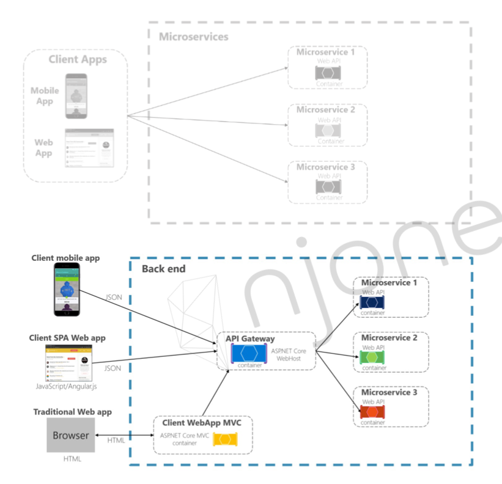

# API Gateway Service



- 클라이언트에서 다이렉트로 MSA 서비스를 요청하지 않고 API Gateway에 요청하면 API Gateway가 요청에 맞는 MSA 서비스 찾아서 응답해준다.

### API Gateway 의 의의

***

- 인증 및 권한 부여
- 서비스 검색 통합
- 응답 캐싱
- 정책, 회로 차단기 및 QoS 다시 시도
- 속도 제한
- 부하 분산(Load Balancer)
- 로깅, 추적, 상관 관계
- 헤더, 쿼리 문자열 및 청구 변환
- IP 허용 목록 추가

### Spring Cloud Netflix Ribbon

***

- Client Side Load Balancer
- Spring Boot 2.4에서 Maintenance 상태

### Spring Cloud Netflix Zuul

***

- Server Side Load Balancer
- Spring Boot 2.4에서 Maintenance 상태

### Spring Cloud Gateway

***


- Server Side Load Balancer
- Eureka와 연동해서 API Gateway 로서의 역할 수행

#### application.yml

***

```yaml
spring:
  cloud:
    gateway:
      default-filters: # 모든 서비스에 적용되는 default-filter 정의
        - name: GlobalFilter
          args:
            baseMessage: Spring Cloud Gateway Global Filter
            preLogger: true
            postLogger: true

      routes: # predicates 에 맞는 경로 요청 시 route uri, filter 정의
        - id: first-service
          uri: lb://FIRST-SERVICE     # Eureka Server에 등록된 Eureka Client 서버의 spring.applicaiton.name 으로 로드밸런싱
          predicates:
            - Path=/first-service/**
          filters:
            - CustomFilter
        - id: second-service
          uri: lb://SECOND-SERVICE
          predicates:
            - Path=/second-service/**
          filters:
            - name: CustomFilter
            - name: LoggingFilter
              args:
                baseMessage: Hi, there
                preLogger: true
                postLogger: true
```

### Spring Cloud Filter

***


#### LoggingFilter

***

- OrderedGatewayFilter 구현체로 GatewayFilter 커스텀 필터 추가
- OrderedGatewayFilter 는 GatewayFilter 를 순서 기능이 추가 된 데코레이터 패턴 으로 구현되어 있음
- 내부 Config 클래스 : 사용자 외부설정 정의
- Netty 비동기 응답 처리를 위해 Mono.fromRunnable() 재정의

```java

@Slf4j
@Component
public class LoggingFilter extends AbstractGatewayFilterFactory<LoggingFilter.Config> {

  public LoggingFilter() {
    super(Config.class);
  }

  @Override
  public GatewayFilter apply(Config config) {

    return new OrderedGatewayFilter((exchange, chain) -> {
      ServerHttpRequest request = exchange.getRequest();
      ServerHttpResponse response = exchange.getResponse();

      log.info("Logging Pre Filter baseMessage : {}", config.getBaseMessage());

      if (config.isPreLogger()) {
        log.info("Logging Pre Filter : request id -> {}", request.getId());
      }

      return chain.filter(exchange).then(Mono.fromRunnable(() -> {
        if (config.isPostLogger()) {
          log.info("Logging Post Filter : response code -> {}", response.getStatusCode());
        }
      }));
    }, Ordered.HIGHEST_PRECEDENCE);
  }

  @Data
  public static class Config {

    // Put the configuration properties
    private String baseMessage;
    private boolean preLogger;
    private boolean postLogger;
  }
}
```

```java
public class OrderedGatewayFilter implements GatewayFilter, Ordered {

  private final GatewayFilter delegate;
  private final int order;

  public Mono<Void> filter(ServerWebExchange exchange, GatewayFilterChain chain) {
    return this.delegate.filter(exchange, chain);
  }
}
```