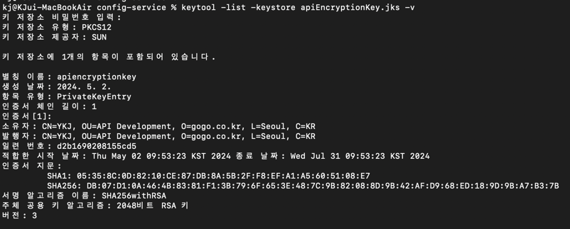

# 설정 정보의 암호화 처리

## 암호화 타입

1. 대칭 암호화(Symmetric Encryption)
    - 대칭키

2. 비대칭키(Asymmetric Encryption)
    - RSA 알고리즘
    - Private and Public Key
    - java keytool

### Symmetric Encryption

***

- bootstrap.yml

```yaml
encrypt:
  key: asdfsadfasdsadafasdasfsadasasdasfasdasfsadaf1234514141253514
```


- user-service.yml

```yaml
spring:
  datasource:
    url: jdbc:h2:tcp://localhost:9099/~/testdb
    username: sa
    #    password: sa
    password: '{cipher}87602981e46d34ad334bea534286c02a0140b15aea613f24f20c49169fd12215'
    driver-class-name: org.h2.Driver
```

### Asymmetric Encryption

- Public, Private Key 생성

  -> JDK keytool 이용


- keytool -genkeypair -alias apiEncryptionKey -keyalg RSA -dname "CN=YKJ, OU=API Development, O=gogo.co.kr, L=Seoul, C=KR" -keypass "1q2w3e4r"
  -keystore apiEncryptionKey.jks -storepass "1q2w3e4r"



- bootstrap.yml

```yaml
encrypt:
  #  key: asdfsadfasdsadafasdasfsadasasdasfasdasfsadaf1234514141253514
  key-store:
    location: file://${user.home}/IdeaProjects/inflearn-spring-boot-msa/springboot-msa-3.0/config-service/apiEncryptionKey.jks
    password: 1q2w3e4r
    alias: apiEncryptionKey
```


- user-service.yml

```yaml
spring:
  datasource:
    url: jdbc:h2:tcp://localhost:9099/~/testdb
    username: sa
    #    password: sa
    password: '{cipher}AQBxJvRfvqVqn++UALFX+I8N3qY2ZxK9dSiVFk3Gjfiqv0jedqDVLFEM27WeaBrXThtW6eKgGSbDa4w2h0mQt6G0scfXCEMylUjxTqdyQktxppa2UMNy5occXnc0oDe8h+wsAz+wjrFawSsY3+BkJxkCVBvW0PpqgcXFOvji0WUy5mKG85i24taxJ9hrOpigdt0wkg9UwUfSqe5aFc19eQiDdefKni0ir9IhIz4GUSpxErOACiWZDlphRGnfh4E/Cz1Vf7DW3hGMi2LhPsh1iaBnEQwzYqBIBGgKfspcF7xE09pbbpVLcf33dBlqdTPwYci/hnG1btpsax/fkIP6MeTTTH46HVjHVDWOT7oaPpGJyGRPJcgQ65+9lKNVPBd+Kwk='
    driver-class-name: org.h2.Driver
```

