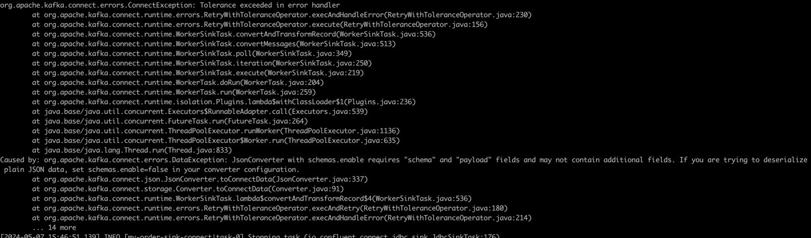
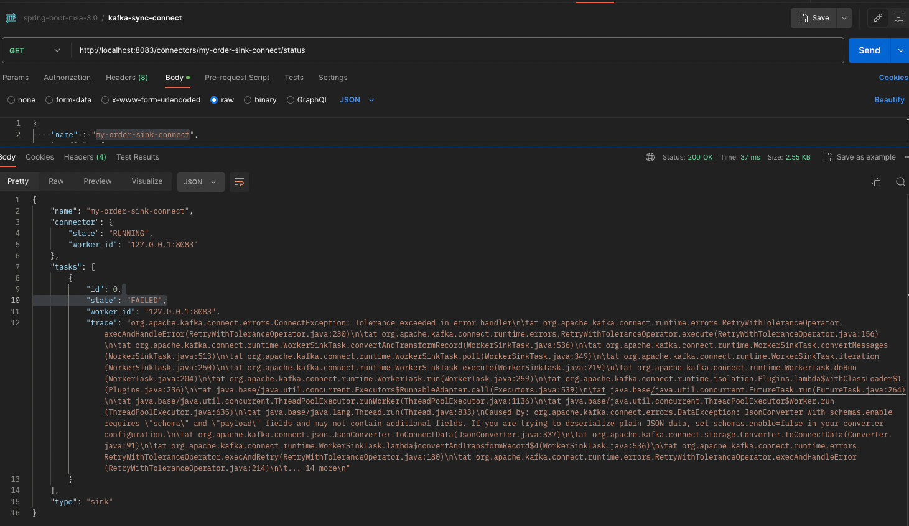
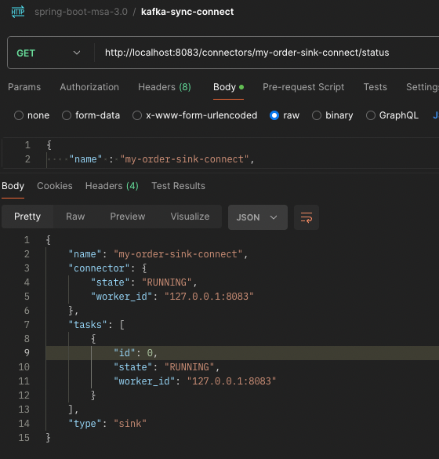

# Kafka SinkConnect Tasks Failed 일 때 초기화 방법

### Kafka JdbcSinkConnect 등록

```http request
POST http://localhost:8083/connectors
Request-Body
{
    "name" : "my-order-sink-connect",
    "config" : {
        "connector.class" : "io.confluent.connect.jdbc.JdbcSinkConnector",
        "connection.url":"jdbc:postgresql://localhost:54315/orderlocaldb",
        "connection.user":"{db.username}",
        "connection.password":"{db.password}",
        "auto.create": "true",
        "auto.evolve" : "true",
        "delete.enabled":"false",
        "tasks.max" : "1",
        "topics" : "orders"
    }
}
```
***

### 오류 원인

Kafka Sink Connector가 JdbcSinkConnector 일 때 request는 {"schema":{}, "payload":{}} 형태 이어야 한다.

그렇지 않으면 아래와 같은 오류가 발생한다.

```
org.apache.kafka.connect.errors.ConnectException: Tolerance exceeded in error handler
	at org.apache.kafka.connect.runtime.errors.RetryWithToleranceOperator.execAndHandleError(RetryWithToleranceOperator.java:230)
	at org.apache.kafka.connect.runtime.errors.RetryWithToleranceOperator.execute(RetryWithToleranceOperator.java:156)
	at org.apache.kafka.connect.runtime.WorkerSinkTask.convertAndTransformRecord(WorkerSinkTask.java:536)
	at org.apache.kafka.connect.runtime.WorkerSinkTask.convertMessages(WorkerSinkTask.java:513)
	at org.apache.kafka.connect.runtime.WorkerSinkTask.poll(WorkerSinkTask.java:349)
	at org.apache.kafka.connect.runtime.WorkerSinkTask.iteration(WorkerSinkTask.java:250)
	at org.apache.kafka.connect.runtime.WorkerSinkTask.execute(WorkerSinkTask.java:219)
	at org.apache.kafka.connect.runtime.WorkerTask.doRun(WorkerTask.java:204)
	at org.apache.kafka.connect.runtime.WorkerTask.run(WorkerTask.java:259)
	at org.apache.kafka.connect.runtime.isolation.Plugins.lambda$withClassLoader$1(Plugins.java:236)
	at java.base/java.util.concurrent.Executors$RunnableAdapter.call(Executors.java:539)
	at java.base/java.util.concurrent.FutureTask.run(FutureTask.java:264)
	at java.base/java.util.concurrent.ThreadPoolExecutor.runWorker(ThreadPoolExecutor.java:1136)
	at java.base/java.util.concurrent.ThreadPoolExecutor$Worker.run(ThreadPoolExecutor.java:635)
	at java.base/java.lang.Thread.run(Thread.java:833)
Caused by: org.apache.kafka.connect.errors.DataException: JsonConverter with schemas.enable requires "schema" and "payload" fields and may not contain additional fields. If you are trying to deserialize plain JSON data, set schemas.enable=false in your converter configuration.
	at org.apache.kafka.connect.json.JsonConverter.toConnectData(JsonConverter.java:337)
	at org.apache.kafka.connect.storage.Converter.toConnectData(Converter.java:91)
	at org.apache.kafka.connect.runtime.WorkerSinkTask.lambda$convertAndTransformRecord$4(WorkerSinkTask.java:536)
	at org.apache.kafka.connect.runtime.errors.RetryWithToleranceOperator.execAndRetry(RetryWithToleranceOperator.java:180)
	at org.apache.kafka.connect.runtime.errors.RetryWithToleranceOperator.execAndHandleError(RetryWithToleranceOperator.java:214)
```
***

### 오류 해결 과정
1. Connector Restart

```http request
POST http://localhost:8083/connectors/my-order-sink-connect
```

2. Connector && Tasks Restart

```http request
POST http://localhost:8083/connectors/my-order-sink-connect/restart?includeTasks=true
```

3. Delete Connector And Post Connector

```http request
DELETE http://localhost:8083/connectors/my-order-sink-connect
```

```http request
POST http://localhost:8083/connectors
Request-Body
{
    "name" : "my-order-sink-connect",
    "config" : {
        "connector.class" : "io.confluent.connect.jdbc.JdbcSinkConnector",
        "connection.url":"jdbc:postgresql://localhost:54315/orderlocaldb",
        "connection.user":"{db.username}",
        "connection.password":"{db.password}",
        "auto.create": "true",
        "auto.evolve" : "true",
        "delete.enabled":"false",
        "tasks.max" : "1",
        "topics" : "orders"
    }
}
```

- 재시작 후에도 여전히 동일한 오류 발생
    <br><br>
    


- Status 확인해도 여전히 tasks 상태가 Failed
    <br><br>
    

***
### 오류 해결

1. kafka-server.properties 설정 파일 추가

```properties
# $CONFLUENT_HOME/etc/kafka/server.properties
delete.topic.enable = true
```

2. kafka-topics.sh --delete 명령 실행

```shell
$ sh $KAFKA_HOME/bin/kafka-topics.sh --bootstrap-server {kafka-server} --delete --topic {topic-name}
```

3. restart connect-distributed

```shell
$ $CONFLUENT_HOME/bin/connect-distributed etc/kafka/connect-distributed.properties
```

- tasks 확인
<br><br>
    

4. 이래도 안 되면 zookeeper.sh 명령어 수행하면 된다고 함

```shell
$ sh $KAFKA_HOME/bin/zookeeper-shell.sh localhost:2181
ls /brokers/topics
[__consumer_offsets, connect-configs, connect-offsets, connect-status, example-catalog-topic, my_topic_users, orders]
rmr /brokers/topics/{topic-name}
```

