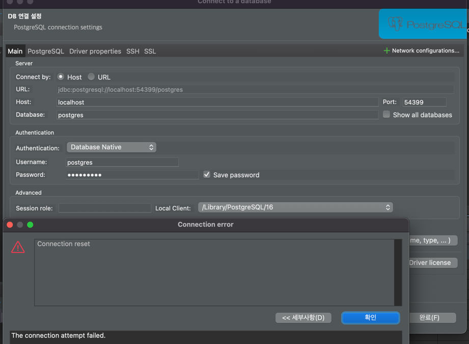
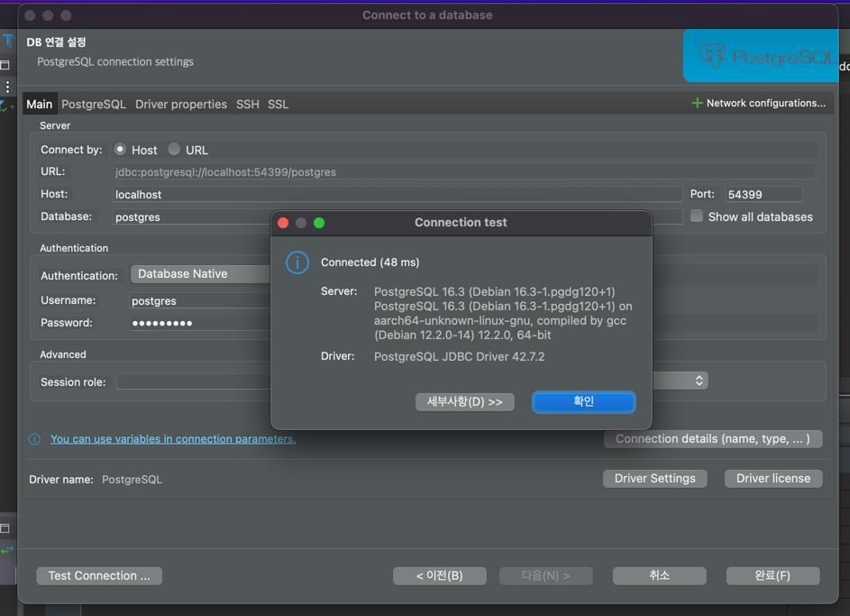

# postgres docker container 내부 port 지정

### docker postgres container 기동
- host port : 54399
- docker 내부 port : 54315

host 시스템에서 54399 포트로 유입 되는 요청은 docker 내부 port 인 54315 포트로 전달된다.

```shell
docker run -d -p 54399:54315 -e POSTGRES_PASSWORD=qwer1234! --name postgresdb postgres
```

***
### 이제 host 시스템에서 54399 포트 접속 시도 해보자

Dbeaver 클라이언트 프로그램에서 54399 포트로 접속을 시도 해보았으나 "Connection Reset" 오류가 발생하였다.




***
### 로그를 먼저 확인해보자.

```shell
docker logs postgresdb
```

```text
2024-05-10 09:44:23.430 UTC [1] LOG:  starting PostgreSQL 16.3 (Debian 16.3-1.pgdg120+1) on aarch64-unknown-linux-gnu, compiled by gcc (Debian 12.2.0-14) 12.2.0, 64-bit
2024-05-10 09:44:23.430 UTC [1] LOG:  listening on IPv4 address "0.0.0.0", port 5432
2024-05-10 09:44:23.431 UTC [1] LOG:  listening on IPv6 address "::", port 5432
2024-05-10 09:44:23.432 UTC [1] LOG:  listening on Unix socket "/var/run/postgresql/.s.PGSQL.5432"
2024-05-10 09:44:23.435 UTC [61] LOG:  database system was shut down at 2024-05-10 09:44:23 UTC
2024-05-10 09:44:23.438 UTC [1] LOG:  database system is ready to accept connections
```

??? 난 54315 포트로 docker container 포트를 지정했는데 postgresql 은 5432 포트로 기동 되었다.

***
### docker container 포트를 5432로 변경해보자

```shell
docker stop postgresdb
docker contanier rm {container.id}

docker run -d -p 54399:5432 -e POSTGRES_PASSWORD=qwer1234! --name postgresdb postgres
```



docker container 포트(5432)와 postgresql 기동 포트(5432)를 일치 시켜줬더니 정상접속이 된 걸 확인 할 수 있다.

***
### 내 Microservice 의 datasource db.port 는 54315로 되어 있었는데.. 다 5432로 바꿔야 하는건가?

- postgresql 포트를 54315 로 기동 될 수 있도록 해보자.
- e 옵션(docker 환경변수 설정)을 통해 "PGPORT=54315" 를 설정해주었다.

```shell
docker run -d -p 54399:54315 -e POSTGRES_PASSWORD=qwer1234! -e PGPORT=54315 --name postgresdb postgres
```

- 기동 로그를 확인해보자.

```shell
docker logs postgresdb
```

```text
2024-05-10 09:56:56.740 UTC [1] LOG:  starting PostgreSQL 16.3 (Debian 16.3-1.pgdg120+1) on aarch64-unknown-linux-gnu, compiled by gcc (Debian 12.2.0-14) 12.2.0, 64-bit
2024-05-10 09:56:56.740 UTC [1] LOG:  listening on IPv4 address "0.0.0.0", port 54315
2024-05-10 09:56:56.741 UTC [1] LOG:  listening on IPv6 address "::", port 54315
2024-05-10 09:56:56.742 UTC [1] LOG:  listening on Unix socket "/var/run/postgresql/.s.PGSQL.54315"
2024-05-10 09:56:56.745 UTC [62] LOG:  database system was shut down at 2024-05-10 09:56:56 UTC
2024-05-10 09:56:56.748 UTC [1] LOG:  database system is ready to accept connections
```

postgres도 54315 포트로 기동 된 것을 확인 할 수 있다.

***
#### 당연히 Dbeaver 에서도 54399 포트로 정상접속이 된다.
